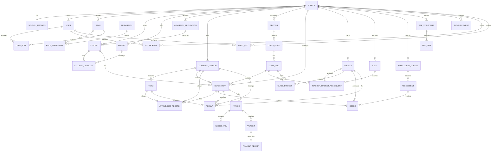

# Nigerian School Management SaaS
## Domain Model, ERD, and Practical Build Guide

> **Purpose:** This document is a working guide for designing and building the School Management SaaS described in the master prompt. Use it beside your code editor. Build from the domain model outward: **workflow → domain → relationships → database → backend → UI**.

---

# 1. The Big Picture

The application is a **multi-tenant School Management SaaS for Nigerian schools**.

A school may contain:

- Nursery
- Primary
- JSS
- SSS
- Custom sections

The core principle is:

> **Model the complete lifecycle of a learner without destroying historical records.**

The most important relationship to understand is:

```text
School
  │
  ├── Users / Roles
  ├── Students
  ├── Parents / Guardians
  ├── Staff / Teachers
  │
  ├── Academic Sessions
  │     └── Terms
  │
  ├── Sections
  │     └── Class Levels
  │           └── Class Arms
  │
  ├── Subjects
  │     └── Class/Subject Assignments
  │
  ├── Enrollments
  │     ├── Attendance
  │     ├── Assessments
  │     └── Results
  │
  ├── Admissions
  ├── Finance
  ├── Communication
  └── Audit Logs
```

The uploaded specification explicitly prioritizes **data integrity, historical records, multi-tenancy, security, RBAC, and maintainability**. These should guide every implementation decision.

---

# 2. Domain Model

The domain model describes the **business objects and their relationships** before you write database code.

Think of it as answering:

> "What things exist in this school system, and how do they interact?"

## 2.1 Tenant / School Domain

### School

Represents one school using the SaaS.

A school is the primary tenant.

Example:

```text
School A
School B
School C
```

Almost every business record belongs to a school.

Examples:

```text
Student.schoolId
Teacher.schoolId
ClassLevel.schoolId
Invoice.schoolId
Result.schoolId
```

### SchoolSettings

Stores configurable school-wide settings.

Possible areas:

- School name and branding
- Logo
- Contact information
- Result settings
- Ranking settings
- Grading preferences
- Other configuration

---

# 3. Identity and Access Domain

## User

Represents an authenticated account.

A user may be:

- Platform Owner
- School Owner
- Administrator
- Principal
- Teacher
- Accountant
- Parent
- Student

Important distinction:

```text
User = login identity
Student = learner business record
Teacher/Staff = employee business record
Parent = guardian business record
```

Do not force every person into one giant `Student` or `Teacher` table.

## Role

Defines a group of permissions.

Examples:

```text
Principal
Teacher
Accountant
Parent
Student
```

## Permission

Defines an individual action.

Examples:

```text
student.view
student.create
student.update
result.approve
result.publish
payment.create
```

## UserRole

Connects users to roles.

This allows a user to have multiple roles where appropriate.

## RolePermission

Connects roles to permissions.

The relationship becomes:

```text
User
  ↓
UserRole
  ↓
Role
  ↓
RolePermission
  ↓
Permission
```

---

# 4. Student Lifecycle Domain

The core learner lifecycle is:

```text
Applicant
   ↓
Application
   ↓
Admission
   ↓
Student Registration
   ↓
Enrollment
   ↓
Class Assignment
   ↓
Attendance
   ↓
Assessment
   ↓
Result
   ↓
Promotion
   ↓
Next Enrollment
   ↓
Graduation / Transfer / Withdrawal
```

## Applicant

Represents a person who is applying but is not yet necessarily a student.

## AdmissionApplication

Represents the actual application.

Possible statuses:

```text
APPLIED
UNDER_REVIEW
EXAMINED
ACCEPTED
REJECTED
WAITLISTED
ENROLLED
```

## Student

Represents the learner after becoming a student.

Possible information:

```text
Student ID
Admission Number
First Name
Middle Name
Last Name
Gender
Date of Birth
Place of Birth
Nationality
State of Origin
LGA
Passport Photograph
Address
City
State
Admission Date
Admission Type
Previous School
```

Sensitive welfare information should be access-controlled.

Examples:

```text
Allergies
Medical Notes
Emergency Contact
```

## Parent / Guardian

Do not store only:

```text
fatherName
fatherPhone
motherName
motherPhone
```

Instead:

```text
Parent
   │
   ├── Student A
   ├── Student B
   └── Student C
```

A student can have multiple guardians.

A parent can have multiple children.

Therefore:

```text
Parent
   ↕
Student
```

is a many-to-many relationship.

Use a junction entity such as:

```text
StudentGuardian
```

It can also store:

```text
Relationship
IsPrimary
CanPickup
CanReceiveNotifications
```

---

# 5. Academic Structure Domain

The academic hierarchy is:

```text
School
  ↓
Section
  ↓
ClassLevel
  ↓
ClassArm
```

Example:

```text
School
  ↓
Primary
  ↓
Primary 4
  ↓
Primary 4A
```

Another example:

```text
School
  ↓
Secondary
  ↓
JSS 1
  ↓
JSS 1A
JSS 1B
JSS 1C
```

## Section

Examples:

```text
Nursery
Primary
JSS
SSS
```

Allow custom sections.

## ClassLevel

Examples:

```text
Primary 1
Primary 2
JSS 1
JSS 2
SS 1
SS 2
```

## ClassArm

Examples:

```text
JSS 1A
JSS 1B
JSS 1C
```

The key reason for separating these three is flexibility.

Do not make:

```text
class = "JSS 1A"
```

your only class representation.

Instead:

```text
Section: Secondary
ClassLevel: JSS 1
ClassArm: A
```

This lets the school create new arms without changing the database design.

---

# 6. Academic Session Domain

## AcademicSession

Examples:

```text
2024/2025
2025/2026
2026/2027
```

## Term

Each session can contain:

```text
First Term
Second Term
Third Term
```

Historical sessions must remain intact.

Example:

```text
2024/2025 → Primary 6A
2025/2026 → JSS 1A
2026/2027 → JSS 2A
```

Never overwrite the old enrollment to say only:

```text
currentClass = JSS 2A
```

The current enrollment can be derived from the student's active enrollment.

---

# 7. Enrollment Domain

`Enrollment` is one of the most important entities.

Instead of:

```text
Student
  currentClass = JSS 2A
```

model:

```text
Student
  │
  ├── Enrollment
  │     2024/2025
  │     Primary 6A
  │
  ├── Enrollment
  │     2025/2026
  │     JSS 1A
  │
  └── Enrollment
        2026/2027
        JSS 2A
```

An enrollment should connect:

```text
Student
AcademicSession
ClassArm
```

Optionally, it may also reference:

```text
Section
ClassLevel
```

if that is useful for reporting.

### Why enrollment is superior

It gives you:

- Complete academic history
- Historical class records
- Historical result context
- Correct attendance context
- Promotion history
- Transfer/exit history
- No destructive updates

The rule is:

> A student can have many historical enrollments but should normally have only one active enrollment for a given academic session.

---

# 8. Subject and Teacher Domain

## Subject

Examples:

```text
Mathematics
English Studies
Basic Science
Physics
Chemistry
Biology
```

Support:

- Subject code
- Subject category
- Department
- Core/elective
- Compulsory/optional

Subjects should be configurable per school.

## Teacher / Staff

Keep staff identity separate from teaching assignments.

A teacher may:

- Teach many subjects
- Teach many classes
- Teach multiple arms
- Be a class/form teacher
- Be an HOD
- Be a principal

## TeacherSubjectAssignment

Connects a teacher to teaching responsibility.

Conceptually:

```text
Teacher
   ↓
Academic Session
   ↓
Subject
   ↓
Class / ClassArm
```

## ClassSubject

Represents the subjects offered to a class or class arm.

This is important because:

```text
School Subject
```

does not automatically mean:

```text
Every class takes this subject
```

---

# 9. Attendance Domain

Recommended architecture for a typical Nigerian school:

> **Daily attendance at student/enrollment level should be the default MVP architecture.**

Model:

```text
Attendance
    ↓
AttendanceRecord
```

Possible statuses:

```text
PRESENT
ABSENT
LATE
EXCUSED
```

Attendance should be connected to:

```text
Student
Enrollment
ClassArm
AcademicSession
Term
Date
```

A daily attendance record can answer:

```text
Was the student present today?
Was the student late?
How many days was the student absent?
```

Calculate:

```text
Total School Days
Days Present
Days Absent
Days Late
Attendance Percentage
```

Do not start with per-subject attendance unless the school's workflow requires it.

If later required, extend the model to support:

```text
AttendanceRecord
   ↓
AttendanceSession
   ↓
Subject / Class
```

---

# 10. Assessment and Results Domain

Do not hard-code:

```text
CA = 40%
Exam = 60%
```

Different schools may use different schemes.

A configurable model is:

```text
AssessmentScheme
       ↓
Assessment Components
       ↓
Scores
       ↓
Result Calculation
       ↓
Result
```

Example:

```text
Assessment Scheme
│
├── CA 1       10%
├── CA 2       10%
├── Assignment 10%
└── Exam       70%
```

Another school:

```text
Assessment Scheme
│
├── Continuous Assessment 40%
└── Examination           60%
```

Possible assessment types:

```text
TEST
ASSIGNMENT
CONTINUOUS_ASSESSMENT
EXAMINATION
PROJECT
PRACTICAL
```

---

# 11. Result Processing Domain

Recommended workflow:

```text
Teacher enters scores
        ↓
System validates scores
        ↓
Teacher submits
        ↓
HOD reviews
        ↓
Administrator / Principal approves
        ↓
Result published
        ↓
Parent / Student views
        ↓
Result locked
```

Statuses:

```text
DRAFT
SUBMITTED
REVIEWED
APPROVED
PUBLISHED
LOCKED
```

Important:

> Publishing and locking a result should not be equivalent to deleting the ability to audit it.

If an authorized correction happens, record it in the audit log.

---

# 12. Grading Domain

Grading must be configurable.

A school may define:

```text
A → 70–100
B → 60–69
C → 50–59
D → 45–49
E → 40–44
F → 0–39
```

Another school may use a different scheme.

Therefore separate:

```text
GradeScale
Grade
```

A grade may contain:

```text
Grade
Minimum Score
Maximum Score
Letter
Remark
Grade Point
```

---

# 13. Primary Behavioral / Skills Domain

Primary schools may assess:

```text
Punctuality
Neatness
Honesty
Leadership
Cooperation
Creativity
Responsibility
```

Use configurable assessment items.

Example:

```text
SkillAssessment
  ↓
AssessmentItem
  ↓
Rating
```

Possible ratings:

```text
Excellent
Very Good
Good
Fair
Poor
```

Do not hard-code these values.

---

# 14. Promotion Domain

Promotion workflow:

```text
Results Completed
      ↓
Promotion Review
      ↓
Promotion Decision
      ↓
Promoted / Conditional / Repeat
      ↓
New Enrollment
```

Possible outcomes:

```text
PROMOTED
PROMOTED_WITH_CONDITIONS
REPEAT
GRADUATED
WITHDRAWN
TRANSFERRED
```

The key rule:

> Promotion should create a new enrollment. It should not overwrite the previous enrollment.

Example:

```text
2025/2026
JSS 1A
        ↓
PROMOTED
        ↓
2026/2027
JSS 2A
```

---

# 15. Exit Domain

Support:

```text
GRADUATED
TRANSFERRED
WITHDRAWN
EXPELLED
```

Store:

```text
Exit Date
Exit Reason
Final Class
Final Academic Session
Certificate Status
Transcript Information
```

Do not delete the student.

The student's historical record remains available.

---

# 16. Finance Domain

The financial workflow is:

```text
Student
   ↓
Enrollment
   ↓
Academic Session
   ↓
Term
   ↓
Fee Structure
   ↓
Invoice
   ↓
Invoice Items
   ↓
Payment
   ↓
Receipt
```

Important concepts:

```text
Amount Billed
Amount Paid
Outstanding Balance
```

Fee items may include:

```text
Tuition
Development Levy
Examination
Textbooks
Uniform
ICT
Transportation
Boarding
Other
```

Support:

```text
Full Payment
Partial Payment
Installments
Discounts
Scholarships
Waivers
Refunds
```

Do not tightly couple your finance domain to Paystack or Flutterwave.

Use an abstraction:

```text
Payment
   ↓
PaymentProviderReference
```

This allows multiple payment providers later.

---

# 17. Communication Domain

Core entities:

```text
Announcement
Notification
```

Communication channels:

```text
In-App
Email
SMS
```

Future:

```text
WhatsApp
```

Target audiences may be:

```text
All Parents
Specific Class
Specific Class Arm
Teachers
Students
Staff
Individual Parent
```

---

# 18. Calendar Domain

The calendar should support:

```text
Academic Session Dates
Term Dates
Resumption
Examination Periods
Mid-Term Breaks
Public Holidays
PTA Meetings
School Events
```

The calendar should interact with:

```text
Attendance
Examinations
Notifications
```

---

# 19. Audit Domain

Audit logs record important actions.

Example:

```text
User
  ↓
Action
  ↓
Record
  ↓
Before Value
  ↓
After Value
  ↓
Timestamp
```

Track:

- Result modification
- Result approval
- Result publication
- Fee modification
- Payment creation
- Student archival
- Role changes
- Permission changes

Audit history should be append-oriented and protected from ordinary users.

---

# 20. Core ERD

This is the conceptual ERD you should use as your starting point.



> **Note:** This ERD is a conceptual starting point. A production Prisma schema will add implementation-level entities such as promotion records, exit records, grading configuration, result approval history, payment provider transactions, and possibly staff/teacher specialization entities.

---

# 21. How to Read the ERD

When you see:

```text
SCHOOL ||--o{ STUDENT
```

Read it as:

> One school can have many students.

When you see:

```text
STUDENT ||--o{ ENROLLMENT
```

Read it as:

> One student can have many enrollments over time.

When you see:

```text
STUDENT ||--o{ STUDENT_GUARDIAN
PARENT ||--o{ STUDENT_GUARDIAN
```

Read it as:

> Student and Parent have a many-to-many relationship implemented through StudentGuardian.

This is how you should reason about every relationship before coding it.

---

# 22. The Most Important Domain Relationships

Before writing Prisma, understand these first:

```text
School
  ↓
Student
  ↓
Enrollment
  ↓
ClassArm
  ↓
AcademicSession
  ↓
Term
```

Then:

```text
Enrollment
  ↓
Attendance
```

```text
Enrollment
  ↓
Scores
  ↓
Result
```

```text
Enrollment
  ↓
Invoice
  ↓
Payment
```

This is the heart of the system.

---

# 23. How to Use the Domain Model to Build the App

Do not start by creating random pages.

Use this sequence:

```text
1. Understand workflow
        ↓
2. Define domain entities
        ↓
3. Define relationships
        ↓
4. Design ERD
        ↓
5. Design database schema
        ↓
6. Define business rules
        ↓
7. Define backend operations
        ↓
8. Define permissions
        ↓
9. Build frontend
        ↓
10. Test complete workflows
```

The domain model tells you **what exists**.

The ERD tells you **how things relate**.

The database schema tells you **how to store them**.

The backend tells you **how they change**.

The UI lets users **interact with them**.

---

# 24. Step 1 — Start with the Tenant

Build:

```text
School
SchoolSettings
```

Then create:

```text
School Onboarding
```

Workflow:

```text
Platform Owner / School Owner
        ↓
Create School
        ↓
Create School Settings
        ↓
Create First Admin User
        ↓
Assign Admin Role
        ↓
Admin enters Dashboard
```

### Build

Database:

```text
School
SchoolSettings
User
Role
UserRole
```

Backend:

```text
createSchool()
createSchoolSettings()
createInitialAdmin()
assignRole()
```

Frontend:

```text
/onboarding
/login
/dashboard
```

Completion criterion:

> A new school can be created and the first administrator can log in.

---

# 25. Step 2 — Build Authentication and RBAC

Build authentication before sensitive modules.

You need:

```text
User
Role
Permission
UserRole
RolePermission
```

At login:

```text
User logs in
    ↓
Session created
    ↓
User identity known
    ↓
School/Tenant known
    ↓
Roles loaded
    ↓
Permissions checked
```

Never rely only on:

```text
Frontend route protection
```

Authorization must also happen on:

```text
Server Actions
API routes
Database queries
```

Every query should be tenant-aware.

Conceptually:

```ts
const schoolId = session.user.schoolId;

await prisma.student.findMany({
  where: {
    schoolId,
  },
});
```

Never trust:

```ts
schoolId = request.body.schoolId
```

without validating that the authenticated user is authorized for that school.

---

# 26. Step 3 — Build Academic Configuration

Before registering students, the school needs academic structure.

Build:

```text
AcademicSession
Term
Section
ClassLevel
ClassArm
Subject
ClassSubject
```

Admin workflow:

```text
Create Academic Session
        ↓
Create Terms
        ↓
Create Sections
        ↓
Create Class Levels
        ↓
Create Class Arms
        ↓
Create Subjects
        ↓
Assign Subjects to Classes
```

Example:

```text
2026/2027
  │
  ├── First Term
  ├── Second Term
  └── Third Term

Primary
  └── Primary 4
        ├── Primary 4A
        └── Primary 4B
```

Build the configuration UI before the student enrollment UI.

---

# 27. Step 4 — Build Student and Parent Management

Now build:

```text
Student
Parent
StudentGuardian
```

Student registration workflow:

```text
Admin
  ↓
Create Student
  ↓
Generate Admission Number
  ↓
Create Parent/Guardian
  ↓
Link Parent to Student
  ↓
Student Record Created
```

Do not immediately overwrite student class fields.

Instead:

```text
Student Created
      ↓
Enrollment Created
      ↓
Student Assigned to Class Arm
```

This preserves history.

---

# 28. Step 5 — Build Enrollment

The enrollment workflow is:

```text
Student
   ↓
Select Academic Session
   ↓
Select Class Arm
   ↓
Create Enrollment
```

Business rule:

```text
One student
    +
One academic session
    +
One active enrollment
```

The database should enforce this as much as possible.

A student may have:

```text
2024/2025 → Primary 6A
2025/2026 → JSS 1A
2026/2027 → JSS 2A
```

The student's dashboard should use the active enrollment.

Historical reports should use the enrollment relevant to that session/term.

---

# 29. Step 6 — Build Teacher Assignments

After academic configuration:

```text
Teacher
  ↓
Assign to Subject
  ↓
Assign to Class Arm
  ↓
Teacher can access assigned academic data
```

Example:

```text
Mr. John
  ↓
Mathematics
  ↓
JSS 2A
```

Authorization then becomes:

```text
Can Mr. John enter scores for JSS 2A Mathematics?

YES → allow
NO  → deny
```

This is much safer than simply checking:

```text
role === "TEACHER"
```

---

# 30. Step 7 — Build Attendance

Recommended MVP workflow:

```text
Teacher/Admin
    ↓
Select Academic Session
    ↓
Select Term
    ↓
Select Class Arm
    ↓
Select Date
    ↓
Load Enrolled Students
    ↓
Mark Attendance
    ↓
Save
```

Database:

```text
Enrollment
    ↓
AttendanceRecord
```

The attendance report can calculate:

```text
Present
Absent
Late
Excused
Percentage
```

---

# 31. Step 8 — Build Assessment and Results

First configure:

```text
AssessmentScheme
```

Example:

```text
CA 1       10%
CA 2       10%
Assignment 10%
Exam       70%
```

Then:

```text
Teacher enters score
        ↓
Score validation
        ↓
Submit
        ↓
HOD review
        ↓
Principal approval
        ↓
Publish
        ↓
Parent views
```

The important design principle is:

> Score entry and result publication are different workflows.

Do not make:

```text
Teacher enters score
        ↓
Result immediately visible to parents
```

unless the school explicitly wants that behavior.

---

# 32. Step 9 — Build Promotion

At the end of the academic session:

```text
Results Complete
       ↓
Review Students
       ↓
Select Promotion Decision
       ↓
Promote / Repeat / Conditional
       ↓
Create Next Enrollment
```

Example:

```text
JSS 1A
  ↓
PROMOTED
  ↓
JSS 2A
```

Do not update:

```text
Enrollment.classArmId
```

to JSS 2A.

Instead create:

```text
New Enrollment
```

This preserves the old record.

---

# 33. Step 10 — Build Finance

After enrollment exists, billing can use:

```text
Student
Enrollment
AcademicSession
Term
```

Workflow:

```text
Configure Fee Structure
        ↓
Assign Fee Structure
        ↓
Generate Invoice
        ↓
Add Invoice Items
        ↓
Parent Pays
        ↓
Record Payment
        ↓
Generate Receipt
        ↓
Update Balance
```

The balance is conceptually:

```text
Amount Billed - Amount Paid
```

Be careful with:

```text
Discounts
Scholarships
Waivers
Refunds
Partial Payments
```

These should be represented explicitly rather than hiding them inside arbitrary balance updates.

---

# 34. Step 11 — Build Parent Portal

The parent portal should use the relationship:

```text
Parent
   ↓
StudentGuardian
   ↓
Student
   ↓
Enrollment
```

Then the parent can see:

```text
Child 1 → JSS 2A
Child 2 → Primary 5B
Child 3 → Primary 2A
```

For each child:

```text
Profile
Attendance
Results
Fees
Payments
Announcements
Calendar
```

Critical authorization rule:

> A parent must only see students linked to that parent.

Never trust a URL such as:

```text
/parent/children/123
```

by itself.

The server must verify:

```text
Does the authenticated parent have access to Student 123?
```

---

# 35. Suggested Next.js Route Structure

A practical App Router structure:

```text
app/
├── (auth)/
│   ├── login/
│   └── forgot-password/
│
├── (school)/
│   ├── dashboard/
│   │
│   ├── students/
│   │   ├── page.tsx
│   │   ├── register/
│   │   └── [id]/
│   │
│   ├── parents/
│   ├── teachers/
│   │
│   ├── academics/
│   │   ├── sessions/
│   │   ├── terms/
│   │   ├── sections/
│   │   ├── class-levels/
│   │   ├── class-arms/
│   │   ├── subjects/
│   │   └── assignments/
│   │
│   ├── attendance/
│   │
│   ├── assessments/
│   │
│   ├── results/
│   │   ├── entry/
│   │   ├── review/
│   │   ├── approval/
│   │   └── published/
│   │
│   ├── admissions/
│   │
│   ├── finance/
│   │   ├── fees/
│   │   ├── invoices/
│   │   ├── payments/
│   │   └── receipts/
│   │
│   ├── communications/
│   │
│   └── settings/
│
└── (portal)/
    └── parent/
```

Organize routes around **business domains**, not database tables alone.

---

# 36. Suggested Backend Organization

Do not put all business logic directly inside page components.

A practical structure:

```text
src/
├── app/
├── actions/
│   ├── students/
│   ├── enrollment/
│   ├── attendance/
│   ├── results/
│   └── finance/
│
├── lib/
│   ├── auth/
│   ├── permissions/
│   ├── tenant/
│   ├── db/
│   └── validation/
│
├── modules/
│   ├── students/
│   │   ├── student.service.ts
│   │   ├── student.repository.ts
│   │   └── student.schema.ts
│   │
│   ├── enrollment/
│   ├── academics/
│   ├── attendance/
│   ├── results/
│   └── finance/
│
└── prisma/
```

The exact folder organization can evolve, but keep the domain boundaries clear.

---

# 37. How to Think About Each Feature

For every feature, ask these questions:

## 1. What is the domain entity?

Example:

```text
AttendanceRecord
```

## 2. Who owns it?

```text
School
```

## 3. What does it belong to?

```text
Enrollment
AcademicSession
Term
```

## 4. Who can access it?

```text
Teacher
Admin
Principal
Parent
```

## 5. Who can modify it?

```text
Teacher
Admin
```

## 6. What business rules apply?

Example:

```text
A teacher can only mark attendance
for assigned classes.
```

## 7. What happens historically?

Example:

```text
Attendance should not disappear
when a student is promoted.
```

## 8. What happens when the record is locked?

Example:

```text
Published result
    ↓
Cannot be edited normally
    ↓
Authorized correction
    ↓
Audit log
```

This thinking pattern prevents random CRUD development.

---

# 38. Build Order

Use this order to avoid rewriting the architecture.

## Milestone 1 — Foundation

Build:

```text
School
SchoolSettings
User
Role
Permission
UserRole
RolePermission
Authentication
Tenant Context
```

Test:

- User can log in.
- User belongs to a school.
- User cannot access another school.
- Permissions work server-side.

---

## Milestone 2 — Academic Configuration

Build:

```text
AcademicSession
Term
Section
ClassLevel
ClassArm
Subject
ClassSubject
```

Test:

```text
2026/2027
  ↓
First Term
  ↓
Secondary
  ↓
JSS 1
  ↓
JSS 1A
  ↓
Mathematics
```

---

## Milestone 3 — Student Management

Build:

```text
Student
Parent
StudentGuardian
AdmissionApplication
```

Test:

- Create student.
- Create parent.
- Link multiple parents.
- Link multiple children.
- Preserve student history.

---

## Milestone 4 — Enrollment

Build:

```text
Enrollment
```

Test:

```text
Student A
2025/2026 → JSS 1A
2026/2027 → JSS 2A
```

Ensure historical enrollment remains intact.

---

## Milestone 5 — Staff and Teaching Assignment

Build:

```text
Staff
TeacherSubjectAssignment
ClassSubject
```

Test:

```text
Teacher A
  ↓
Mathematics
  ↓
JSS 2A
```

Teacher should only access authorized classes/subjects.

---

## Milestone 6 — Attendance

Build:

```text
AttendanceRecord
```

Test:

- Mark attendance.
- Prevent duplicate attendance for same student/date/session context.
- Generate attendance summary.

---

## Milestone 7 — Assessment and Results

Build:

```text
AssessmentScheme
Assessment
Score
GradeScale
Grade
Result
```

Then implement:

```text
DRAFT
SUBMITTED
REVIEWED
APPROVED
PUBLISHED
LOCKED
```

Test the complete approval workflow.

---

## Milestone 8 — Promotion

Build:

```text
Promotion
PromotionDecision
```

Then:

```text
Current Enrollment
       ↓
Promotion Decision
       ↓
New Enrollment
```

Test that old history remains unchanged.

---

## Milestone 9 — Finance

Build:

```text
FeeStructure
FeeItem
Invoice
InvoiceItem
Payment
PaymentReceipt
```

Test:

```text
₦100,000 invoice
₦60,000 payment
₦40,000 outstanding
```

Also test partial payments and discounts.

---

## Milestone 10 — Parent Portal

Build:

```text
Parent authentication
Parent-child access
Results
Attendance
Finance
Announcements
```

Test authorization carefully.

---

## Milestone 11 — Audit and Communication

Build:

```text
AuditLog
Announcement
Notification
```

Then add:

```text
Email
SMS
```

---

# 39. MVP vs Version 1 vs Future

## MVP

Focus on the core school workflow:

```text
School
Authentication
RBAC
Academic Sessions
Terms
Sections
Classes
Class Arms
Subjects
Students
Parents
Enrollment
Attendance
Results
Promotion
Basic Fees
Invoices
Payments
Receipts
```

## Version 1

Add:

```text
Parent Portal
Notifications
Announcements
Advanced Reporting
Result Approval Workflow
Audit Logs
Configurable Grading
Configurable Assessment
Payment Gateway Integration
```

## Future

Postpone:

```text
Payroll
HR
Leave Management
Transport
Hostel
Library
Inventory
Timetable
Advanced Messaging
WhatsApp
Advanced Analytics
External Exam Integration
```

Do not build all of these before the core workflow works.

---

# 40. The Golden Development Rule

When building a new feature, move through this chain:

```text
BUSINESS WORKFLOW
      ↓
DOMAIN ENTITY
      ↓
RELATIONSHIP
      ↓
BUSINESS RULE
      ↓
DATABASE MODEL
      ↓
SERVER ACTION / API
      ↓
AUTHORIZATION
      ↓
UI
      ↓
TEST
```

Example: Attendance

```text
Business Workflow
Teacher marks daily attendance
        ↓
Domain Entity
AttendanceRecord
        ↓
Relationship
AttendanceRecord → Enrollment
        ↓
Business Rule
Teacher can only mark assigned class
        ↓
Database
AttendanceRecord table
        ↓
Backend
markAttendance()
        ↓
Authorization
Check teacher assignment
        ↓
UI
Attendance page
        ↓
Test
Teacher cannot mark another class
```

This is how you should build the application.

---

# 41. What You Should Do Next

Do **not** immediately create every Prisma model from the entire specification.

Instead:

### Step 1

Draw the domain model on paper.

Focus on:

```text
School
User
Student
Parent
AcademicSession
Term
Section
ClassLevel
ClassArm
Enrollment
Subject
Teacher
```

### Step 2

Understand the relationships.

Especially:

```text
Student → Enrollment
Student ↔ Parent
Section → ClassLevel → ClassArm
Session → Term
ClassArm ↔ Subject
Teacher ↔ ClassArm ↔ Subject
```

### Step 3

Create the ERD.

Verify the relationships before Prisma.

### Step 4

Create the Prisma schema for **Milestone 1 only**.

Start with:

```text
School
SchoolSettings
User
Role
Permission
UserRole
RolePermission
```

### Step 5

Migrate and test.

### Step 6

Build authentication and tenant isolation.

### Step 7

Add academic configuration.

### Step 8

Add students and enrollment.

Then continue milestone by milestone.

---

# 42. Final Mental Model

When you are coding the app, keep this picture in your head:

```text
                    SCHOOL
                       │
       ┌───────────────┼────────────────┐
       │               │                │
     USERS          ACADEMICS         FINANCE
       │               │                │
      RBAC        SESSION / TERM      INVOICE
       │               │                │
       │         CLASS STRUCTURE       PAYMENT
       │               │                │
       │          CLASS ARM           RECEIPT
       │               │
       │            SUBJECT
       │               │
       │          ASSIGNMENTS
       │
       └───────────────┐
                       │
                    STUDENT
                       │
                PARENT / GUARDIAN
                       │
                  ENROLLMENT
                       │
          ┌────────────┼─────────────┐
          │            │             │
      ATTENDANCE    ASSESSMENT     RESULTS
                                       │
                                  PROMOTION
                                       │
                                NEW ENROLLMENT
                                       │
                             GRADUATION / EXIT
```

The **Enrollment** entity is the bridge between the learner and the academic year.

The **School** is the tenant boundary.

The **User/Role/Permission** system controls access.

The **ERD** describes relationships.

The **Prisma schema** implements the ERD.

The **backend services/server actions** enforce business rules.

The **Next.js UI** gives users access to those operations.

That is the architecture you should build around.
